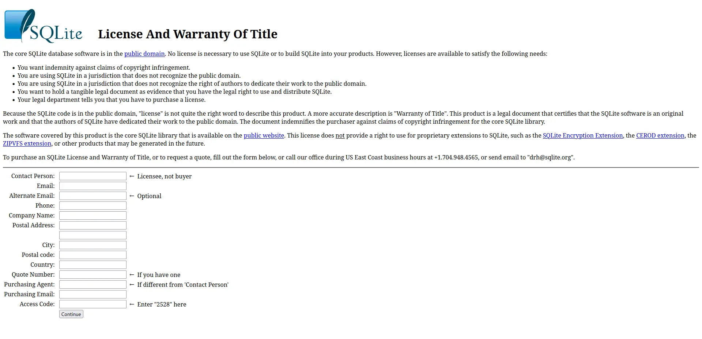

# Zero-Clause BSD

This license is defined by the following components:

- Pubic Domain

IF THE FOLLOWING IS APPLIED:

- No further requirements

MD icon:

> None found. PR one in!

## Resources

- [Deed](https://opensource.org/license/0bsd/)

## Special Considerations

Putting things in the public domain is hard. Not all countries recognize public domain.

In a major project, you may even consider doing something like what SQLite has done and have something like an "artificial purchase page"

You can see it yourself here: <https://sqlite.org/purchase/license>
