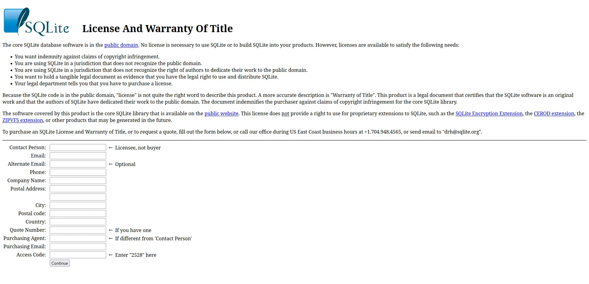

# Creative Commons CC0 [](http://creativecommons.org/publicdomain/zero/1.0/)

This license is defined by the following components:

- Pubic Domain

IF THE FOLLOWING IS APPLIED:

- No further requirements

MD icon:

```md
[](http://creativecommons.org/publicdomain/zero/1.0/)
```

## Resources

- [Deed](https://creativecommons.org/publicdomain/zero/1.0/)
- [legalcode.txt](https://creativecommons.org/publicdomain/zero/1.0/legalcode.txt)
- [Legal Code](https://creativecommons.org/publicdomain/zero/1.0/legalcode.en)

## Special Considerations

Putting things in the public domain is hard. Not all countries recognize public domain.

Consider using [0BSD](../0BSD/readme.md). CC0's legal reliability is disputed. Companies like Google and other big companies involved in open source will refuse to make contributions to projects under CC0.

<https://opensource.google/documentation/reference/patching#forbidden>

[The Unlicense is not allowed to be used inside Google, however an equivalent license 0BSD is. github.com/choosealicense.com#805](https://github.com/github/choosealicense.com/issues/805)

<https://en.wikipedia.org/wiki/Public-domain-equivalent_license#Reception>

In a major project, you may even consider doing something like what SQLite has done and have something like an "artificial purchase page"

You can see it yourself here: <https://sqlite.org/purchase/license>
